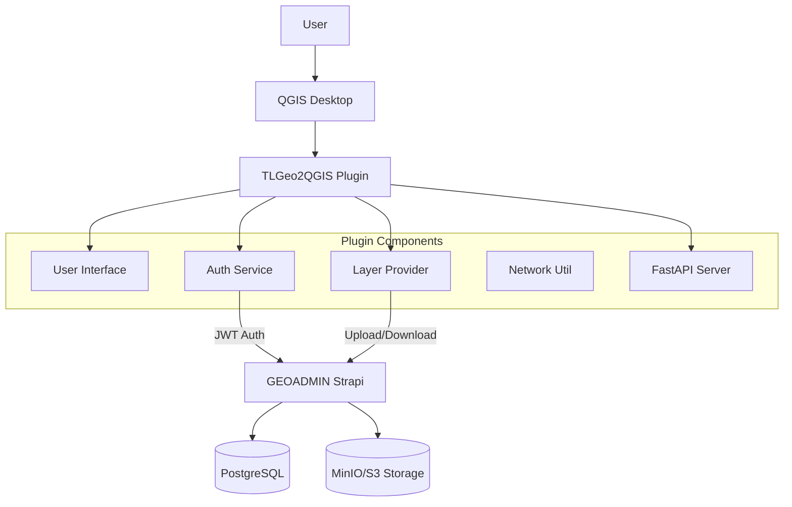
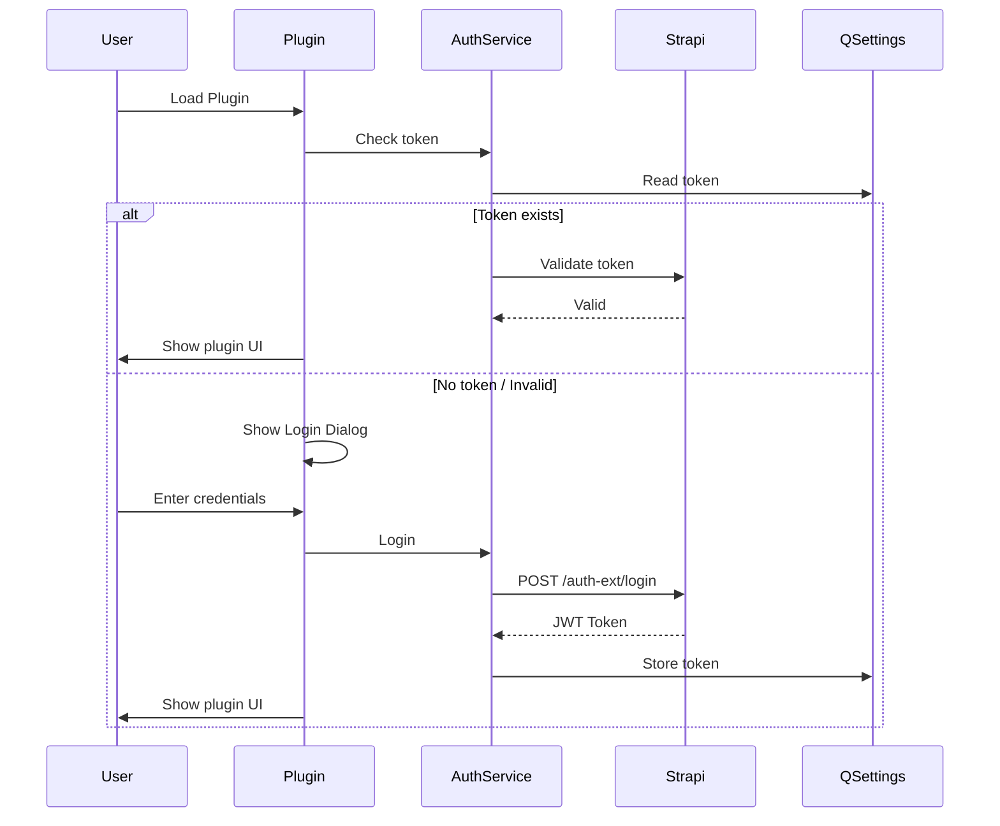
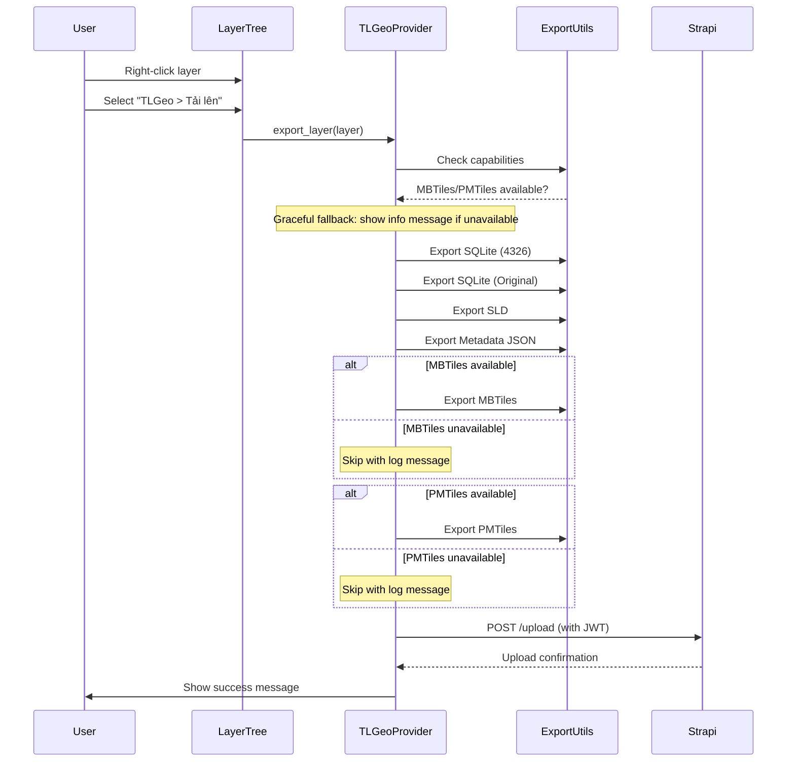
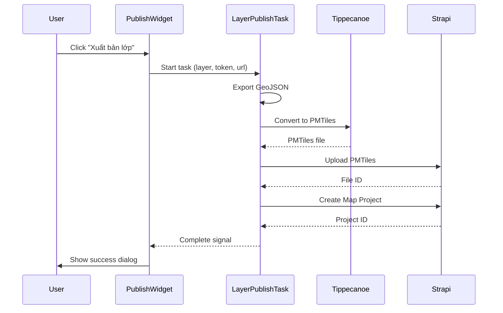

# Architecture Overview

## System Architecture

TLGeo2QGIS is a QGIS plugin designed to integrate QGIS Desktop with the GEOADMIN ecosystem.



## Core Components

### 1. Main Plugin Class (`TLGeoQGISPlugin`)
- **Location**: `src/main.py`
- **Responsibility**:
  - Initializes plugin UI and menus
  - Manages plugin lifecycle (init, unload)
  - Coordinates between Auth and Layer services
  - Handles User Profile display
  - Manages FastAPI server for remote commands

### 2. Authentication Service (`AuthService`)
- **Location**: `src/app/auth/util/auth_service.py`
- **Responsibility**:
  - Manages JWT tokens (Storage in `QSettings`)
  - Handles Login/Logout via `auth-ext` APIs
  - Validates tokens and retrieves user info
  - Provides security checks (HTTPS)

### 3. Layer Menu Provider (`TLGeoProvider`)
- **Location**: `src/layer_menu_provider.py`
- **Responsibility**:
  - Injects context menus into QGIS Layer Tree
  - Handles layer export (SQLite, MBTiles, PMTiles, SLD)
  - Manages file upload to Strapi with Authentication
  - Export location: `~/TLGeo_Exports/{uuid}/`
- **Graceful Fallback**: If MBTiles/PMTiles unavailable:
  - Shows info message (non-blocking)
  - Continues with SQLite/SLD/Metadata export
  - No dialogs interrupt user flow

### 4. Publish Widget (`PublishWidget`)
- **Location**: `src/app/projects/ui/publish_widget.py`
- **Responsibility**:
  - Dock widget for layer publishing
  - Shows layer information before upload
  - Progress tracking with background tasks

### 5. Layer Publish Task (`LayerPublishTask`)
- **Location**: `src/app/projects/tasks/layer_publish_task.py`
- **Responsibility**:
  - Background task for async layer processing
  - GeoJSON export → PMTiles conversion (tippecanoe) → Upload
  - Thread-safe implementation (QgsTask)

### 6. UI Components (`src/ui/`, `src/app/**/ui/`)
- **LoginDialog**: Custom dialog for authentication
- **QRCodeDialog**: For displaying mobile connection info
- **ToolsWidget**: Tools management interface

## Data Flow

### Authentication Flow



### Layer Upload Flow (Right-Click Method)



**Key Points:**
- **No blocking dialogs** when formats unavailable
- **Info message** shown in QGIS message bar
- **Continues seamlessly** with available formats
- **Upload proceeds** regardless of format availability

### Publish Widget Flow (Background Task)



## Export Formats & Requirements

| Format | File Extension | Driver/Method | Minimum Version |
|--------|---------------|---------------|-----------------|
| SQLite | `.sqlite` | `QgsVectorFileWriter` | Any |
| SLD | `.sld` | `layer.saveSldStyle()` | Any |
| MBTiles | `.mbtiles` | `native:writevectortiles_mbtiles` | QGIS 3.14 |
| MBTiles (GDAL) | `.mbtiles` | `QgsVectorFileWriter` | GDAL with driver |
| PMTiles | `.pmtiles` | `QgsVectorFileWriter` | GDAL 3.8 |

## File Structure

```
src/
├── __init__.py                    # Plugin entry point
├── main.py                        # TLGeoQGISPlugin class
├── layer_menu_provider.py         # TLGeoProvider (context menu)
├── logo.png                       # Plugin icon
├── metadata.txt                   # QGIS plugin metadata
│
├── app/
│   ├── auth/
│   │   ├── __init__.py
│   │   ├── ui/
│   │   │   ├── __init__.py
│   │   │   ├── login_dialog.py    # Login dialog
│   │   │   └── profile_widget.py  # User profile
│   │   └── util/
│   │       ├── __init__.py
│   │       └── auth_service.py    # JWT management
│   │
│   ├── projects/
│   │   ├── __init__.py
│   │   ├── ui/
│   │   │   ├── __init__.py
│   │   │   ├── publish_widget.py  # Publish dock widget
│   │   │   └── project_list_widget.py
│   │   ├── tasks/
│   │   │   ├── __init__.py
│   │   │   └── layer_publish_task.py  # Background task
│   │   └── util/
│   │       ├── __init__.py
│   │       └── project_service.py
│   │
│   └── tools/
│       ├── __init__.py
│       ├── ui/
│       │   ├── __init__.py
│       │   ├── tools_widget.py
│       │   ├── qr_code_dialog.py   # QR for mobile connect
│       │   └── gdal_update_dialog.py
│       └── util/
│           ├── __init__.py
│           ├── dependency_checker.py
│           └── gdal_installer.py
│
├── components/
│   ├── tabs/
│   │   └── tab_manager.py
│   └── ribbon/
│       └── ribbon_widget.py
│
├── ui/
│   ├── __init__.py
│   └── dock_widget.py             # TLGeoContentDock, TLGeoRibbonDock
│
└── util/
    ├── __init__.py
    ├── fastapi_server.py          # Remote control server
    └── net_util.py                # Network utilities
```

## Tech Stack

- **Language**: Python 3.9+ (QGIS environment)
- **UI Framework**: PyQt5
- **Networking**: `requests` library
- **GIS Core**: `qgis.core`, `qgis.gui`
- **Build System**: Bash scripts + python-minifier (for production)
- **Task Management**: `QgsTask` for background operations
- **Web Server**: FastAPI + Uvicorn (for remote commands)

## Related Documentation

- [Layer Upload Guide](../guides/LAYER_UPLOAD.md)
- [Authentication Guide](../guides/AUTHENTICATION.md)
- [GDAL Upgrade Guide](../guides/GDAL_UPGRADE_GUIDE.md)
- [QGIS Versions & Export Capabilities](../guides/QGIS_VERSIONS.md)
