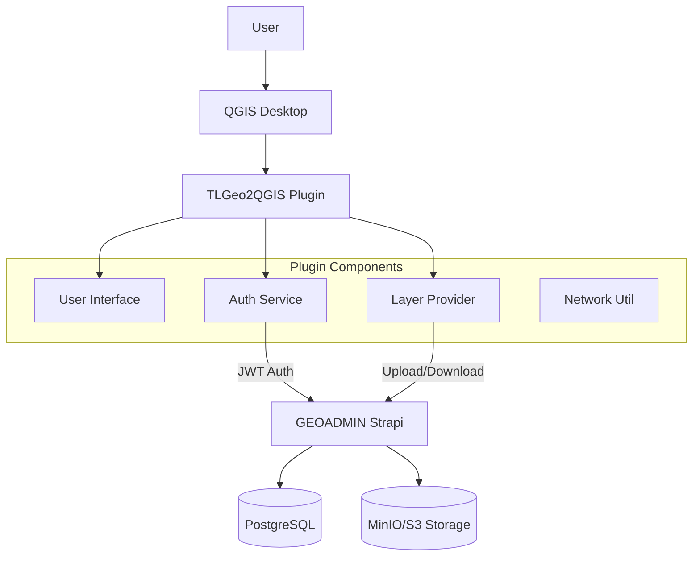

# Architecture Overview

## System Architecture

TLGeo2QGIS is a QGIS plugin designed to integrate QGIS Desktop with the GEOADMIN ecosystem.

## Core Components

### 1. Main Plugin Class (`TLGeoQGISPlugin`)
- **Location**: `src/main.py`
- **Responsibility**: 
  - Initializes plugin UI and menus
  - Manages plugin lifecycle (init, unload)
  - Coordinates between Auth and Layer services
  - Handles User Profile display

### 2. Authentication Service (`AuthService`)
- **Location**: `src/util/auth_service.py`
- **Responsibility**:
  - Manages JWT tokens (Storage in `QSettings`)
  - Handles Login/Logout via `auth-ext` APIs
  - Validates tokens and retrieves user info
  - Provides security checks (HTTPS)

### 3. Layer Menu Provider (`TLGeoProvider`)
- **Location**: `src/layer_menu_provider.py`
- **Responsibility**:
  - Injects context menus into QGIS Layer Tree
  - Handles layer export (SQLite, MBTiles, PMTiles)
  - Manages file upload to Strapi with Authentication

### 4. UI Components (`src/ui/`)
- **LoginDialog**: Custom dialog for authentication
- **QRCodeDialog**: For displaying mobile connection info

## Data Flow

1. **Authentication**:
   - User inputs credentials -> `AuthService.login()` -> POST `/api/auth-ext/login`
   - Server returns JWT -> Stored in `QSettings`

2. **Layer Upload**:
   - User right-clicks layer -> Select "Upload"
   - Plugin exports layer to format (e.g., SQLite)
   - Plugin reads JWT from `AuthService`
   - Plugin uploads file -> POST `/api/upload` (Header: `Authorization: Bearer <token>`)

## Tech Stack

- **Language**: Python 3.9+ (QGIS environment)
- **UI Framework**: PyQt5
- **Networking**: `requests` library
- **GIS Core**: `qgis.core`, `qgis.gui`
- **Build System**: Bash scripts + PyArmor (for production)
