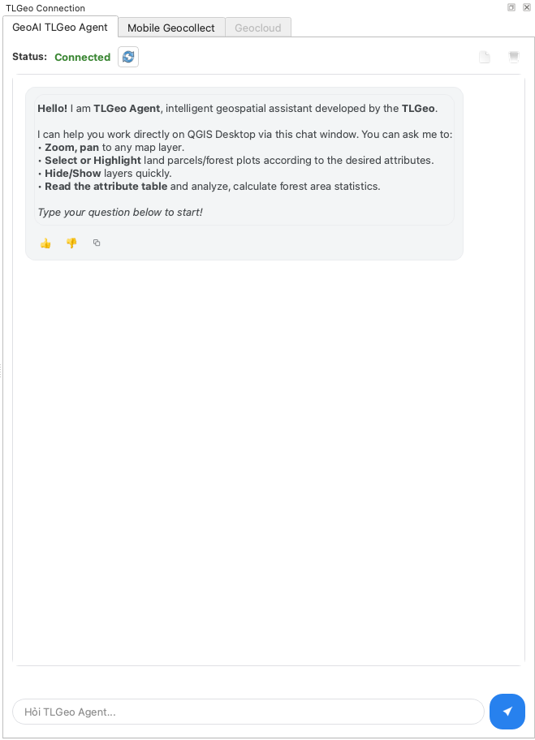
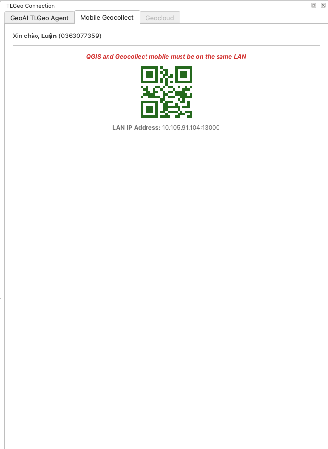
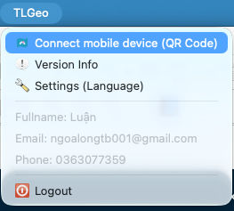

# TLGeo2QGIS

TLGeo2QGIS is a QGIS plugin that acts as an intelligent geospatial agent and a client to access TLGeo data sources, allowing users to collaborate, publish, and manage layers seamlessly with the TLGeo platform.

## Features

- **GeoAI TLGeo Agent**: Interactive chat assistant dock widget that allows users to query, analyze, and manipulate map layers using conversational commands.
- **Mobile Geocollect Integration**: Connects mobile devices to QGIS via a local network to sync geospatial data collection using a QR code connection.
- **One-Click Layer Upload & Export**: Right-click context menu option (`TLGeo > Tải lên`) to publish vector layers directly. Supports export to various formats including SQLite (original & EPSG:4326), SLD, MBTiles, and PMTiles (dependent on GDAL versions).
- **Authentication**: JWT-based secure user authentication to log in to the TLGeo platform directly from QGIS.
- **Version & Capability Checker**: Displays detailed information about QGIS, GDAL versions, and supported export features in QGIS.

## Screenshots

### 1. GeoAI TLGeo Agent
Conversational assistant to interact with layers and run geographic tasks:

### 2. Mobile Geocollect
Seamless LAN connection to mobile devices for fieldwork collection:

### 3. Layer Upload Context Menu
One-click upload for vector layers with styling and metadata:

## Installation & Setup

1. Copy the plugin directory into your QGIS plugins folder:
   - **Windows**: `C:\Users\<User>\AppData\Roaming\QGIS\QGIS3\profiles\default\python\plugins\tlgeo2qgis`
   - **macOS**: `~/Library/Application Support/QGIS/QGIS4/profiles/default/python/plugins/tlgeo2qgis` (or `QGIS3`)
   - **Linux**: `~/.local/share/QGIS/QGIS3/profiles/default/python/plugins/tlgeo2qgis`
2. Open QGIS, go to **Plugins** -> **Manage and Install Plugins...** and enable **TLGeo2QGIS**.
3. Log in through the **TLGeo** menu in QGIS to start publishing layers and interacting with the GeoAI assistant.

## Requirements

All required libraries (such as `fastapi`, `uvicorn`, `websockets`, `qrcode`, `python-multipart`, `python-dotenv`, `requests`, and `markdown`) are automatically verified and installed into an isolated, local directory (`~/.tlgeo/ext_libs`) upon the first loading of the plugin. No manual system-wide package installations are required.

## License

This plugin is licensed under the GNU General Public License v2 or later.
